

  
  

<h1 align="center">mods</h1>

Small mods for Claude Code.

## pixel-cat

The cat, a gray tabby, replaces the orange working dots in the desktop app. The cat plays 9 moves in a new order every turn. About one turn in four it also gets a random color scheme.

  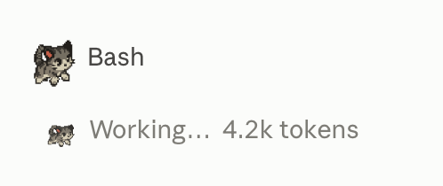

<table align="center">
  <tr>
    <td align="center">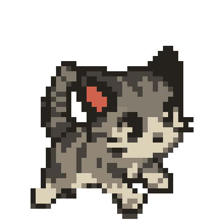 run</td>
    <td align="center">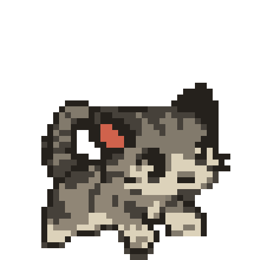 jump</td>
    <td align="center">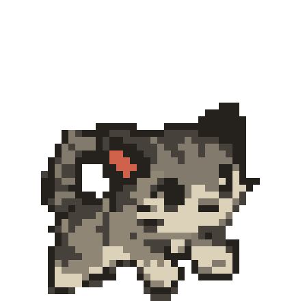 pounce</td>
    <td align="center">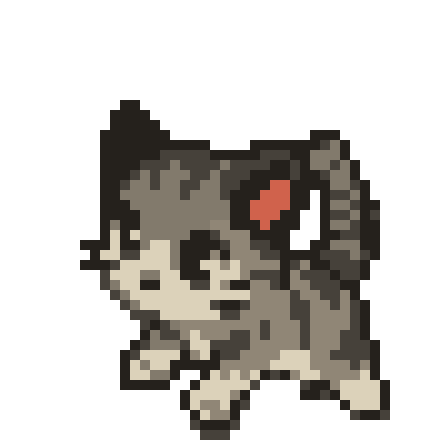 turn</td>
    <td align="center">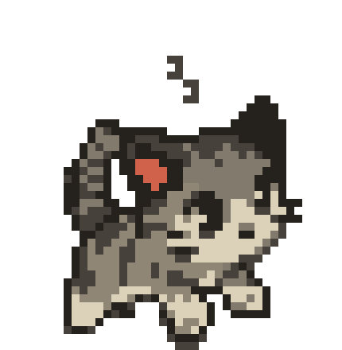 nap</td>
    <td align="center">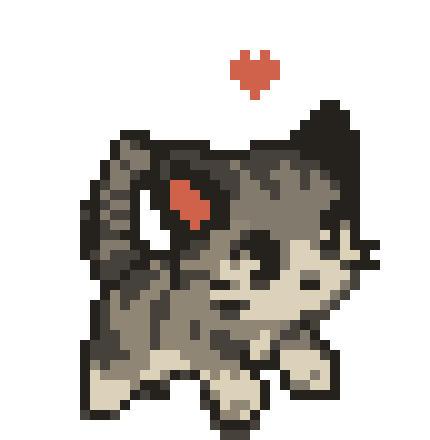 heart</td>
    <td align="center">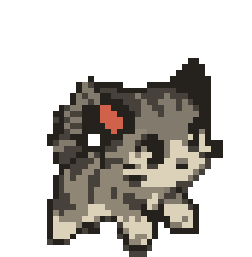 tail</td>
    <td align="center">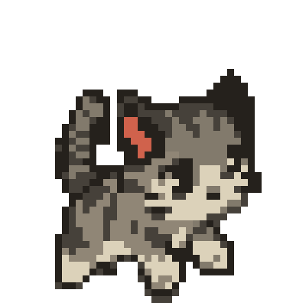 tilt</td>
    <td align="center">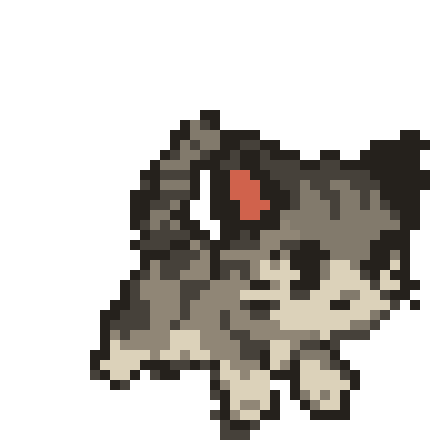 bow</td>
  </tr>
</table>

To install it, see [pixel-cat/README.md](pixel-cat/README.md).

## pixel-cherie

Cherie, a pixel poodle puppy, replaces the orange working dots in the desktop app. Cherie plays 4 moves in a new order every turn.

  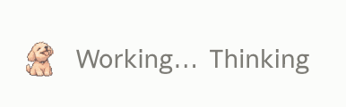

<table align="center">
  <tr>
    <td align="center">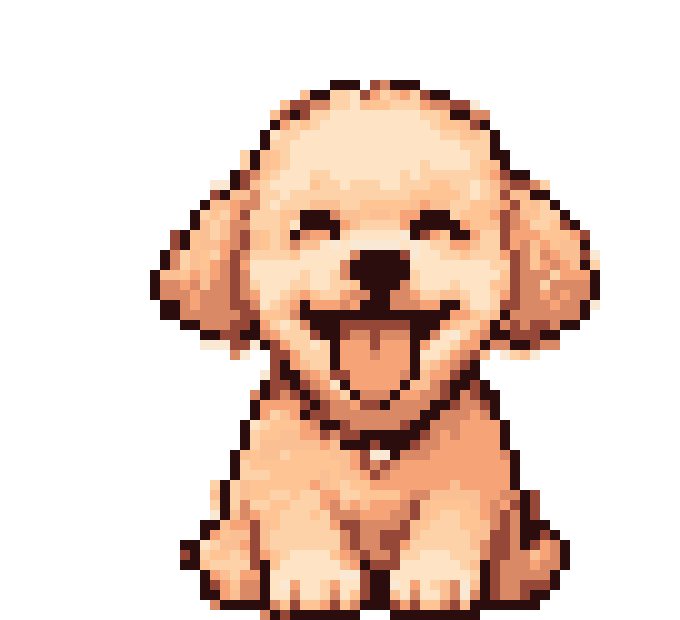 play</td>
    <td align="center">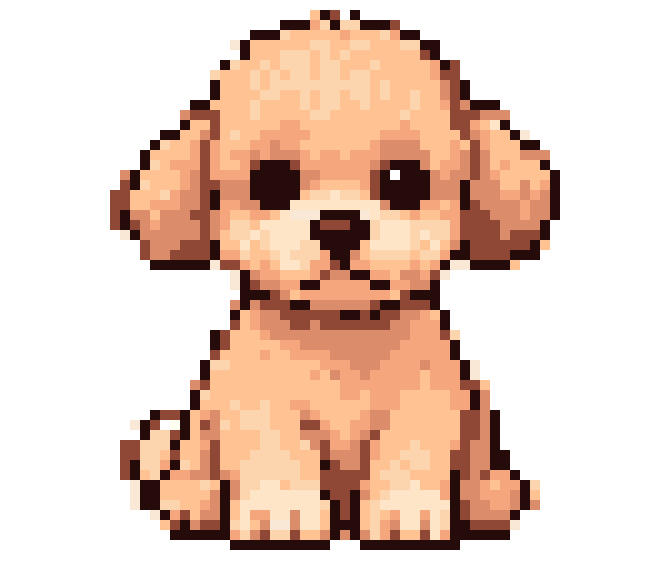 sit</td>
    <td align="center">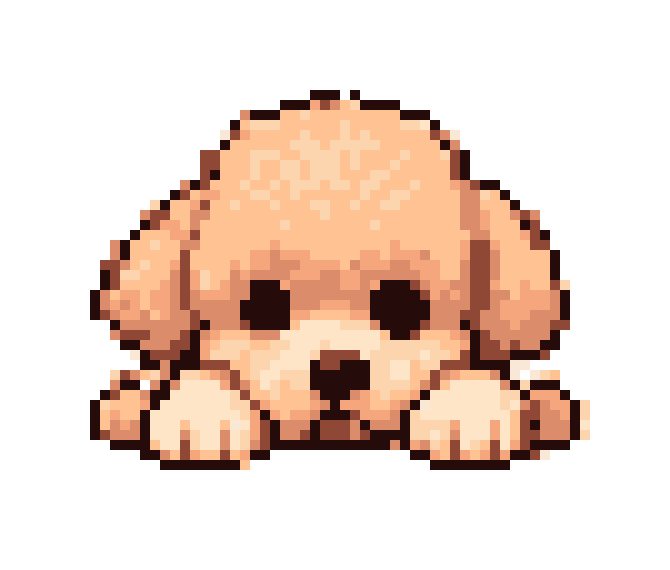 rest</td>
    <td align="center">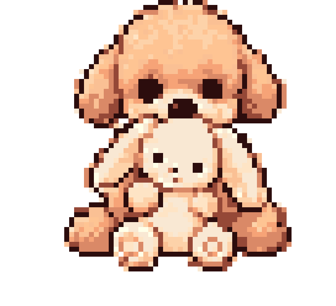 bunny</td>
  </tr>
</table>

To install it, see [pixel-cherie/README.md](pixel-cherie/README.md).

## Choosing a pet

With several pet mods loaded, each turn shows one of them. Type `/pet cat`, `/pet cherie` or `/pet random` in the desktop app to choose for the rest of the session.
